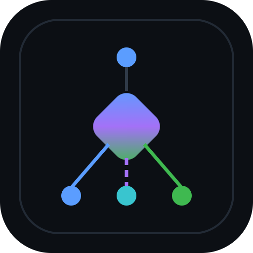

<p align="center"></p>

<h1 align="center">Liminality</h1>

<p align="center">Hand it the hard part: tough questions, real decisions, multi-step tasks, over MCP.</p>

---

Liminality takes a hard question, a decision, or a multi-step task, breaks it into the
sub-questions that actually decide the answer, ties each one to a real tool or endpoint, and
gives you back a worked result you can check and reuse. For a choice you get a scored decision
frame; for a question, a grounded answer. It earns its keep on the work that one-shot guessing
gets wrong, the hard and high-stakes stuff, not quick lookups.

Every solved ask is saved as a reusable route in a shared library, so the second time someone
asks something close, it comes back faster and costs less. It runs as a hosted remote server
over streamable HTTP. The first few asks on a new key are free.

## Connect

Remote server, nothing to install:

```json
{ "mcpServers": { "liminality": { "url": "https://mcp.physea.ai/mcp" } } }
```

- **Endpoint:** `https://mcp.physea.ai/mcp`
- **Transport:** streamable HTTP (remote/hosted)
- **Auth:** API key (`X-API-Key` or `Authorization: Bearer`) or OAuth2. Free tier on a new key.
- **Get a key / docs:** https://physea.ai/mcp

## Tools

- **`solve`** — the front door. Give it anything non-trivial; it works out the structure
  (decompose → ground to real tools → score the decision) and returns a worked result: a scored
  decision frame for a choice, or a grounded answer for a question.
- `research` — a deeper multi-source pass that pulls real information for a question.
- `ask_form` / `apply_form` — when the answer depends on your specifics, it hands back a short
  multiple-choice form; relay it, then `apply_form` folds the answers into a sharper result.
- `get_my_context` — what's known about you and what you've connected.
- `register_asset` / `set_preference` — tell it about your material and how you like results.
- `report_feedback` / `report_outcome` — tell it how a result did, so the routes improve with use.
- `composio_connect` — connect a tool so an action can run against it.

## Discovery / manifests

- `https://mcp.physea.ai/.well-known/mcp`
- `https://mcp.physea.ai/.well-known/agent.json`
- `https://mcp.physea.ai/.well-known/ai-plugin.json`
- `https://mcp.physea.ai/llms.txt`

## Links

- Site & docs: https://physea.ai/mcp
- Privacy: https://physea.ai/privacy-policy
- By [Physea](https://physea.ai)

---

© 2026 Physea. All rights reserved. "Liminality", the name, and the logo are trademarks of
Physea. This repository is a listing for a hosted service; no rights to the service, its
software, or its data are granted. Use of the service is governed by the terms at
https://physea.ai/mcp.
